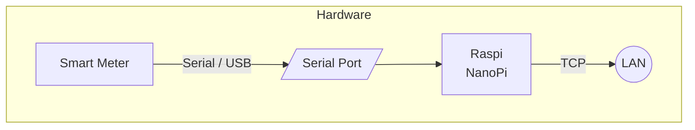
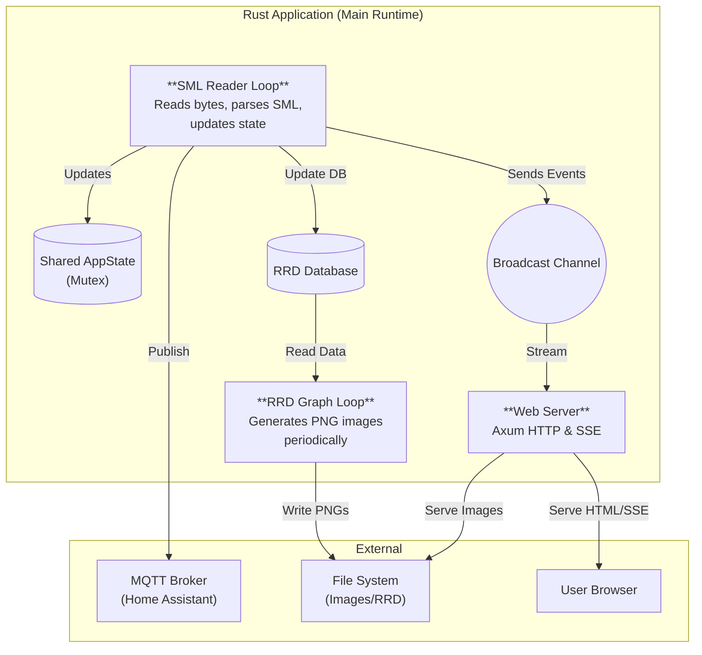

# Smart Meter SML Reader & Visualizer

A robust, asynchronous Rust application designed to read energy consumption data from smart meters via SML (Smart Message Language). It features real-time visualization, historical data logging (RRD), and Home Assistant integration via MQTT.

The project is suitable for embedded devices (e.g. Raspberry Pi), servers, and containerized environments.

## 🚀 Features

* **Serial SML Parsing:** Reads binary SML messages from USB IR optical heads (e.g., for EHZ meters).
* **Real-time Dashboard:** Web interface with Server-Sent Events (SSE) for live power consumption updates.
* **Historical Data:** Stores metrics in a Round Robin Database (RRD) for efficient long-term storage.
* **Graph Generation:** Automatically generates hourly, daily, and weekly PNG charts (English & German).
* **Home Assistant Ready:** Auto-discovery and state publishing via MQTT.
* **Feed-in Calculation:** Logic to calculate energy export even if the meter only provides signed power values.

---

## 🏗 System Architecture

The application runs on the `tokio` runtime and orchestrates three main asynchronous tasks.

## Prerequisites

- Rust toolchain (`cargo`, `rustc`)
- rrdtool and development headers (`librrd-dev` on Debian/Ubuntu)
- Optional: `cross`, Docker
- Runtime tools (depending on setup): `socat`, `systemd`

## Web Assets

Ensure a `static/` directory exists in the working directory containing your `index.html` and other assets, or configure the path in the web handler source.

---

## LICENSE
This program is licensed under GPL-3.0-only

---
